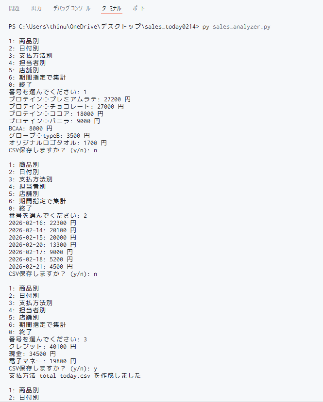

# sales-analyzer
# Sales Analyzer (Python)

CSV形式の売上データを集計するPythonツールです。

## 🔧 主な機能
- 商品別集計
- 日付別集計
- 支払方法別集計
- 担当者別集計
- 店舗別集計
- 期間指定集計
- CSV出力機能

## 🖥 実行方法

1. sales_today.csv を用意
2. ターミナルで以下を実行

python sales_analyzer.py

3. メニューから番号を選択

## 💡 使用技術
- Python
- csvモジュール
- クラス設計

## 📷 実行画面

---

学習目的で作成しました。
